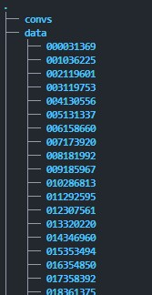
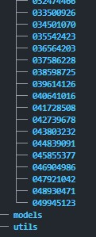

# itri_cil_goods

## manual
1. git clone this repo `https://github.com/yfjeffliu/itri_cil_goods.git`
2. `cd itri_cil_goods`
3. create a virtual environment  `conda env create -f ./environment.yml` and activate it `conda activate itri_cil_goods_env_py37`
4. install nginx for proxy sesrver by `sudo apt install nginx`
5. change nginx setup file by `cp nginx_setting /etc/nginx/sites-available/default`
6. restart nginx with `sudo systemctl restart nginx.service`
7. run `python app.py` to start the webserver
8. follow the instruction in 設置ip以及創建apk檔說明.pdf, set ip and port according to your webserver
9. move the apk file to your android cellphone and install it

若有資料，請建立一個data資料夾，並把資料放入，如下圖結構

